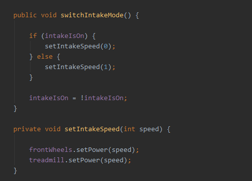

 
<h1>Algumas funções do Krypto (nosso robô)</h1>
 
<h3>Rodas Flexíveis (squishy wheels)</h3>

 Para nosso sistema de coleta (intake) utilizamos
    algumas rodas flexíveis, elas estão conectadas em um core hex motor, através de uma barra hexagonal.
    Criamos uma função para ativar e desativar a rotação delas, assim como a rotação da nossa esteira, que
    também está atrelada a um core hex motor.

<figure></figure>

 Quando um determinado botão for ativado pelo controlador, a
    função <code>switchIntakeMode</code> será chamada, alterando o estado do sistema de coleta, se ele estiver
    desativado será ativado e vice-versa.

<h3>Canhão (shooter) e Gatilho (trigger)</h3>

No nosso canhão utilizamos um HD Hex Motor com 6000 rpm e um Smart
    Robot Servo.

<figure></figure>

 Na imagem acima estão duas funções que utilizamos no nosso
    canhão, a primeira atribui ao nosso motor velocidade máxima, para efetuarmos os lançamentos. Além de chamar a
    segunda função, o número necessário de vezes, para ativação do gatilho.

 Para controlarmos o número de argolas presentes no robô,
    utilizamos uma variável chamada <code>ringCount</code>, que é alimentada toda vez que uma argola entra no robô,
    através de um sensor de cor.

<h3>Braço (arm) e Garra (claw)</h3>

 No braço utilizamos um HD Hex Motor para articulação e um Smart
    Robot Servo para &quot;pegar&quot; o gol pêndulo.

<figure></figure>

 A função <code>rotateArm</code> faz uso do encoder presente no
    motor, para fazer uma rotação de 90 graus, movimento necessário para o braço descer e subir. A variável
    <code>armIsUp </code>identifica o estado do braço, para identificar a direção da rotação.

 A segunda, chamada <code>toggleClaw</code> abre e fecha a garra,
    também faz uso de uma variável, para identificar qual o seu estado, se chama <code>clawIsClosed</code>.

<h3>Sensores</h3>

 Nós também utilizamos alguns sensores em nosso robô, aqui estão
    algumas funções que utilizam eles.

 

<ul>
    <li><strong><code>getRobotPosition</code></strong></li>
</ul>
<figure></figure>

 Nessa, fazemos uso de uma biblioteca chamada Vuforia, em conjunto
    com uma Webcam, para que, a partir das imagens presentes nas paredes da arena, possamos identificar a posição do
    robô.

 

<ul>
    <li><strong><code>getRobotRotation</code></strong></li>
</ul>
<figure></figure>

 Nesse caso, também fazemos uso do Vuforia e da Webcam, porém, as
    utilizamos para identificar qual a rotação em três eixos de nosso robô. 

 

<ul>
    <li><strong><code>getAngle</code></strong></li>
</ul>
<figure></figure>

 Esse método também possui como objetivo identificar qual a
    rotação do nosso robô, nos eixos X (roll), Y (pitch) e Z (heading). Porém faz uso do sensor IMU, que contém um
    giroscópio em usa composição e está presente no hub. 

<ul>
    <li><code>identifyStarterStack</code></li>
</ul>
<figure></figure>

 Como o nome indica, usamos essa função para identificar qual o
    número de argolas presentes na pilha inicial. Para o reconhecimento de imagem, utilizamos tfod (TensorFlow Object
    Detection).

<h3>Mecanum wheels</h3>
<figure></figure>

Para movimentação do nosso robô, desenvolvemos um método que
    calcula qual velocidade cada motor deve receber, de acordo com a velocidade e direção de cada movimento.

Ele recebe três variáveis, que caracterizam três diferentes
    movimentos.

<ul>
    <li>Drive - Para frente e para trás</li>
</ul>
<ul>
    <li>Strafe - Para esquerda e direita</li>
</ul>
<ul>
    <li>Twist - Rotação no próprio eixo</li>
</ul>

Elas representam a velocidade do movimento específico e podem ser
    ativadas ao mesmo tempo. A função fará um cálculo a partir de todas elas, para descobrir qual a a velocidade e
    trajetória final.

Trajetos combinados serão possíveis, como por exemplo o
    deslocamento na diagonal, que basicamente é resultado da combinação do Drive e Strafe.

